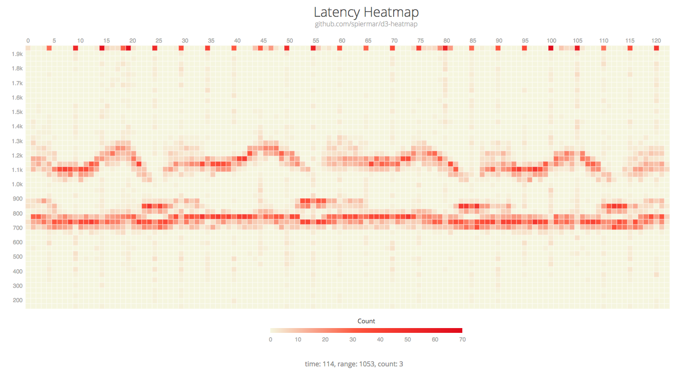

# d3-heatmap2

A D3.js plugin that produces heatmaps.

[](https://github.com/spiermar/d3-heatmap2/)

## Example

Click [here](http://bl.ocks.org/spiermar/raw/76dc64a7716205df91e51b485a2445e8/) to check the demo, and [source](https://gist.github.com/spiermar/76dc64a7716205df91e51b485a2445e8).

## Installing

If you use NPM, `npm install d3-heatmap2`. Otherwise, download the [latest release](https://github.com/spiermar/d3-heatmap2/releases/latest).

## Getting Started

```html
<head>
  <link rel="stylesheet" type="text/css" href="https://cdn.jsdelivr.net/gh/spiermar/d3-heatmap2@0.1/dist/d3-heatmap2.css">
</head>
<body>
  <div id="chart"></div>
  <div id="details"></div>
  <script src="https://d3js.org/d3.v4.min.js" charset="utf-8"></script>
  <script src="https://cdn.jsdelivr.net/gh/spiermar/d3-heatmap2@0.1/dist/d3-heatmap2.js"></script>
  <script>
    d3.json("data.json", function(error, data) {
        if (error) return console.warn(error)    
        var h = d3.heatmap()
            .width(960)
            .xAxisScale([0,120])
            .yAxisScale([0,2000])
            .colorScale(d3.scaleLinear()
                .domain([0, 65 / 2, 65])
                .range(['#F5F5DC', '#FF5032', '#E50914'])
            )
            
        d3.select("#chart")
            .datum(data)
            .call(h)
    })
  </script>
</body>
```

## Heatmap Data Structure

```json
[
    [1,0,0],
    [0,1,0],
    [0,0,1]
]
```

## API Reference

<a href="#title" name="title">#</a> heatmap.<b>title</b>(<i>[title]</i>)

Heatmap title. Defaults to _empty_ if not set. If called with no arguments, `title` will return the heatmap title. 

<a href="#subtitle" name="subtitle">#</a> heatmap.<b>subtitle</b>(<i>[subtitle]</i>)

Heatmap subtitle. Defaults to _empty_ if not set. If called with no arguments, `subtitle` will return the heatmap subtitle. 

<a href="#legendLabel" name="legendLabel">#</a> heatmap.<b>legendLabel</b>(<i>[label]</i>)

Heatmap label legend. Defaults to _empty_ if not set. If called with no arguments, `legendLabel` will return the heatmap label legend. 

<a href="#width" name="width">#</a> heatmap.<b>width</b>(<i>[width]</i>)

Heatmap width in _px_. Defaults to 960px if not set. If called with no arguments, `width` will return the heatmap width. 

<a href="#margin" name="margin">#</a> heatmap.<b>margin</b>(<i>[object]</i>)

Heatmap title. Defaults to the values below if not set.

```js
{
    top: 20,
    right: 0,
    bottom: 0,
    left: 0
}
```

If called with no arguments, `margin` will return the heatmap margin object. 

<a name="colorScale" href="#colorScale">#</a> heatmap.<b>colorScale</b>(<i>[function]</i>)

Replaces the built-in color scale function. The scale function takes no arguments, and returns a [d3.scale](https://github.com/d3/d3-scale) function. Example:

```js
heatmap.colorScale(d3.scaleLinear()
    .domain([0, 65 / 2, 65])
    .range(['#FFFFFF', '#ff5032', '#e50914'])
);
```

If called with no arguments, `colorScale` will return the heatmap _colorScale_ function.

<a name="xAxisScale" href="#xAxisScale">#</a> heatmap.<b>xAxisScale</b>(<i>[array]</i>)

Heatmap xAxis scale domain, in a value scale array format. Defaults to `null` if not set, which displays the xAxis labels instead of the scale.

```js
heatmap.xAxisScale([0, 1000]);
```

If called with no arguments, `xAxisScale` will return the heatmap xAxis scale domain array.

<a name="yAxisScale" href="#yAxisScale">#</a> heatmap.<b>yAxisScale</b>(<i>[array]</i>)

Heatmap yAxis scale domain, in a value scale array format. Defaults to `null` if not set, which displays the yAxis labels instead of the scale.

```js
heatmap.yAxisScale([0, 100]);
```

If called with no arguments, `yAxisScale` will return the heatmap yAxis scale domain array.

<a name="xAxisLabelFormat" href="#xAxisLabelFormat">#</a> heatmap.<b>xAxisLabelFormat</b>(<i>[function]</i>)

Heatmap xAxis label formatter function. The label formatter function takes a single argument, the label array value, and returns a label string. Defaults to `function (d) { return d }` if not set, which displays the value in the xAxis labels array.

```js
heatmap.xAxisLabelFormat(function (d) { return d + ' sec' });
```

If called with no arguments, `xAxisLabelFormat` will return the heatmap xAxis label formatter function.

<a name="yAxisLabelFormat" href="#yAxisLabelFormat">#</a> heatmap.<b>yAxisLabelFormat</b>(<i>[function]</i>)

Heatmap yAxis label formatter function. The label formatter function takes a single argument, the label array value, and returns a label string. Defaults to `function (d) { return d }` if not set, which displays the value in the yAxis labels array.

```js
heatmap.yAxisLabelFormat(function (d) { return d + ' bucket' });
```

If called with no arguments, `yAxisLabelFormat` will return the heatmap yAxis label formatter function.

<a name="xAxisTickFormat" href="#xAxisTickFormat">#</a> heatmap.<b>xAxisTickFormat</b>(<i>[function]</i>)

Heatmap xAxis tick format function. The tick format function takes a single argument, the tick value, and returns a formatted tick. Defaults to `d3.format('.0f')` if not set.

```js
heatmap.xAxisTickFormat(d3.format('.0f'));
```

If called with no arguments, `xAxisTickFormat` will return the heatmap xAxis tick format function.

<a name="yAxisTickFormat" href="#yAxisTickFormat">#</a> heatmap.<b>yAxisTickFormat</b>(<i>[function]</i>)

Heatmap yAxis tick format function. The tick format function takes a single argument, the tick value, and returns a formatted tick. Defaults to `d3.format('.2s')` if not set.

```js
heatmap.yAxisTickFormat(d3.format('.2s'));
```

If called with no arguments, `yAxisTickFormat` will return the heatmap yAxis tick format function.

<a href="#hideLegend" name="hideLegend">#</a> heatmap.<b>hideLegend</b>(<i>[bool]</i>)

Hide heatmap legend. Defaults to `false` if not set. If called with no arguments, `hideLegend` will return the status of the heatmap legend.

<a name="onClick" href="#onClick">#</a> heatmap.<b>onClick</b>(<i>[function]</i>)

Defines a function that will be executed when the user clicks on a frame. Function takes 3 arguments, the value, the column index and row index respectively.

```js
heatmap.onClick(function (d, i, j) {
    console.info("Clicked on row " + j + ", column " + i + ", value " + d);
});
```

If called with no arguments, `onClick` will return the click handler.

<a name="onMouseOver" href="#onMouseOver">#</a> heatmap.<b>onMouseOver</b>(<i>[function]</i>)

Defines a function that will be executed when the user hovers the mouse over a frame. Function takes 3 arguments, the value, the column index and row index respectively.

```js
heatmap.onMouseOver(function (d, i, j) {
    document.getElementById("details").innerHTML = "column: " + i + ", row: " +  j + ", value: " + d
});
```

If called with no arguments, `onMouseOver` will return the click handler.

<a name="xAxisLabels" href="#xAxisLabels">#</a> heatmap.<b>xAxisLabels</b>(<i>[array]</i>)

Heatmap xAxis labels array. Defaults to `null` if not set, which hides de xAxis label.

```js
heatmap.xAxisLabels([0, 1, 2, ...]);
```

If called with no arguments, `xAxisLabels` will return the heatmap xAxis labels array.

<a name="yAxisLabels" href="#yAxisLabels">#</a> heatmap.<b>yAxisLabels</b>(<i>[array]</i>)

Heatmap yAxis labels array. Defaults to `null` if not set, which hides de yAxis label.

```js
heatmap.yAxisLabels([0, 1, 2, ...]);
```

If called with no arguments, `yAxisLabels` will return the heatmap yAxis labels array.

<a name="highlightColor" href="#highlightColor">#</a> heatmap.<b>highlightColor</b>(<i>[string]</i>)

Heatmap highlight base color. Defaults to `#936EB5` if not set. If called with no arguments, `highlightColor` will return the heatmap highlight base color.

<a name="highlightOpacity" href="#highlightOpacity">#</a> heatmap.<b>highlightOpacity</b>(<i>[string]</i>)

Heatmap highlight opacity. Defaults to `0.4` if not set. If called with no arguments, `highlightOpacity` will return the heatmap highlight opacity.

<a name="setHighlight" href="#setHighlight">#</a> heatmap.<b>setHighlight</b>(<i>[string]</i>)

Set heatmap highlight ranges. Defaults to `[]` if not set, which doesn't highlight any frame. 

```js
heatmap.setHighlight(
    [
        {"start": [0,0], "end": [0,3]},
        {"start": [1,0], "end": [1,3]}
    ]
);
```

The highlight range object must contain a start property and an end property. Start and end properties are tuples, `[column, row]` coordinates, in a two integer array format.

If called with no arguments, `setHighlight` will return the selected heatmap highlight ranges.

<a name="updateHighlight" href="#updateHighlight">#</a> heatmap.<b>updateHighlight</b>()

Updates the heatmap highlights based on the ranges set by the `setHighlight` function. `updateHighlight` is executed automatically at first draw, if highlight ranges are set.

```js
heatmap.updateHighlight();
```

`updateHighlight` takes no arguments and returns `void`.

## Acknowledgements

Thank you [Nadieh Bremer](https://twitter.com/NadiehBremer) for the visual inspiration and [D3.js examples](https://www.visualcinnamon.com/2016/05/smooth-color-legend-d3-svg-gradient.html).
